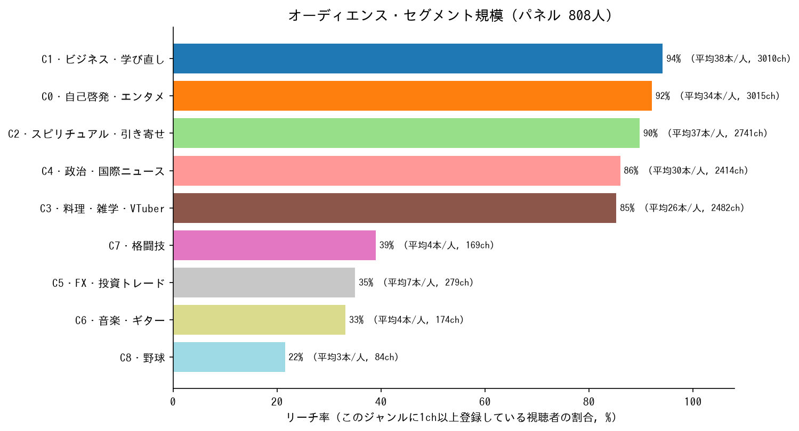
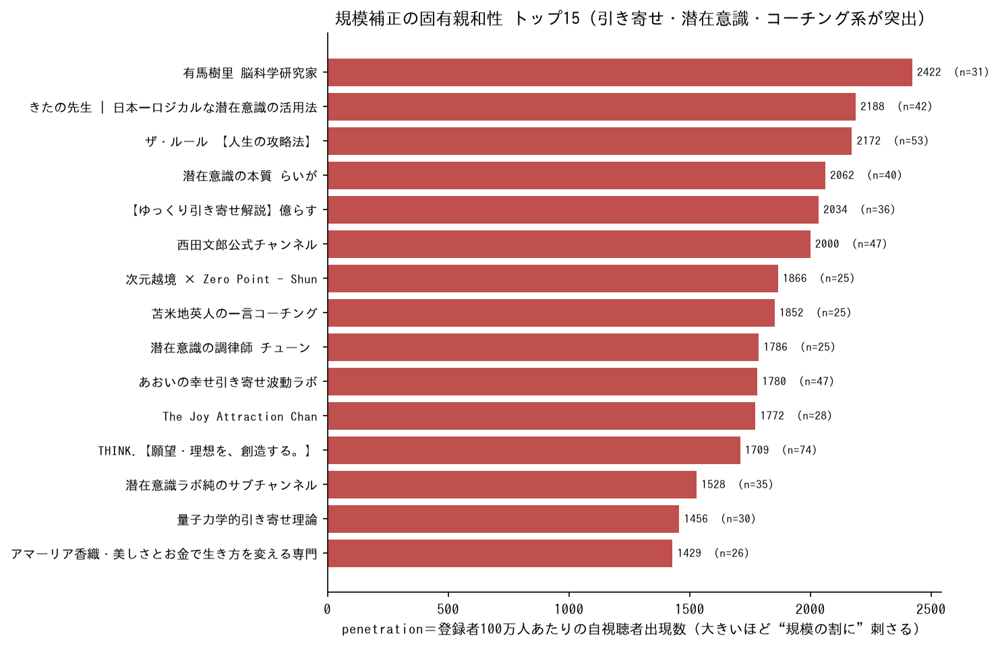
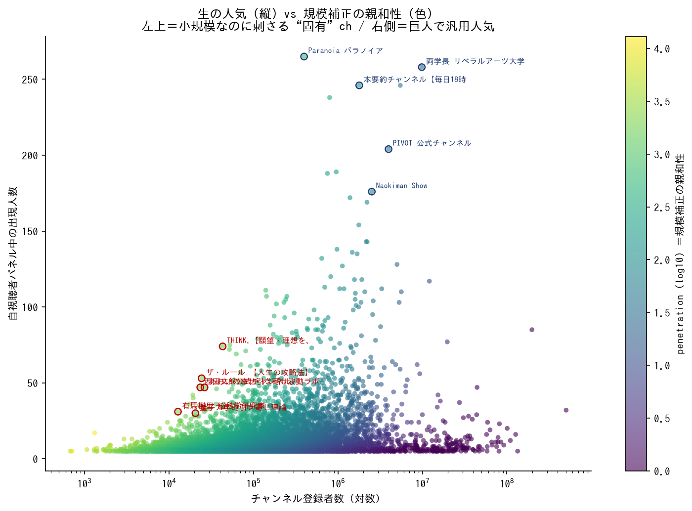
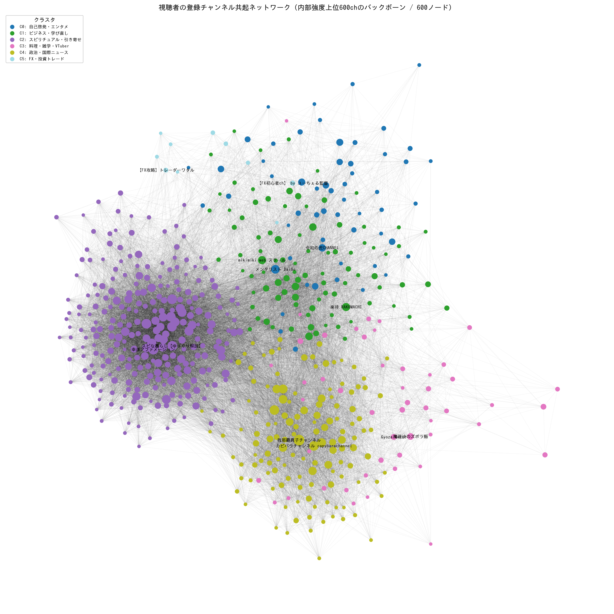

# 視聴者オーディエンス分析レポート

自チャンネルのコメント投稿者の「公開登録チャンネル」から、視聴者層の関心構造を推定したもの。
コメント投稿者（パネル）＝ **808人**、その公開登録から延べ **235,024件**・ユニークチャンネル **106,568**。
1人あたり登録数は中央値 **162本**（最大993本）。Louvain クラスタリングで **50コミュニティ**に分割。

> データ出典: `edges_anon.csv` / `channel_communities.csv` / `channel_community_summary.csv` /
> `channel_panel_overlap_metrics.csv` / `channel_network_edges_filtered.csv`（ノートブック実行で生成）。

---

## 結論（3行）

1. このオーディエンスの背骨は **「ビジネス・自己啓発」×「スピリチュアル・引き寄せ」の二本柱**。どちらもリーチ9割超。
2. 規模を補正すると、この層“**固有**”の指向は明確に **引き寄せ・潜在意識・量子力学・脳科学コーチング系**にある。
3. 周辺関心として **政治・国際ニュース / 料理・雑学 / FX・投資 / 音楽・格闘技・野球** のニッチ群が分布。

---

## 1. オーディエンス・セグメント規模

各クラスタ（ジャンル）に1ch以上登録している視聴者の割合（リーチ率）と、1人あたり平均登録本数。



| クラスタ | テーマ | リーチ率 | 平均本数/人 |
|---|---|---:|---:|
| C1 | ビジネス・学び直し | 94% | 38 |
| C0 | 自己啓発・エンタメ | 92% | 34 |
| C2 | スピリチュアル・引き寄せ | 90% | 37 |
| C4 | 政治・国際ニュース | 86% | 30 |
| C3 | 料理・雑学・VTuber | 85% | 26 |
| C7 | 格闘技 | 39% | 4 |
| C5 | FX・投資トレード | 35% | 7 |
| C6 | 音楽・ギター | 33% | 4 |
| C8 | 野球 | 22% | 3 |

**読み方**: 上位5クラスタはリーチ85〜94%＝視聴者はジャンル横断的（雑食）。一方で平均登録本数（C1=38, C2=37, C0=34）に
「どこに深くコミットしているか」が表れる。下位の C5〜C8 は明確なニッチ・ファン層。

---

## 2. 「生の人気」と「規模補正の親和性」は別物

### 生の人気（出現人数 = sample_share）トップ

| チャンネル | 出現 | 占有率 | 登録者数 |
|---|---:|---:|---:|
| Paranoia_パラノイア【有益】 | 265人 | 32.8% | 39.8万 |
| 両学長 リベラルアーツ大学 | 258人 | 31.9% | 984万 |
| NAKATA UNIVERSITY | 246人 | 30.4% | 548万 |
| 本要約チャンネル【毎日18時更新】 | 246人 | 30.4% | 179万 |
| ひすいこたろうの名言セラピー | 238人 | 29.5% | 79.9万 |

生の人気は**巨大なビジネス・自己啓発・要約系**が上位を占める＝「この層が普段見ている基準」。

### 規模補正の固有親和性（penetration＝登録者100万人あたりの自視聴者出現数）トップ



登録者規模で割ると、上位は **引き寄せ・潜在意識・量子力学・脳科学コーチング系の小規模チャンネル**に一変する
（有馬樹里・きたの先生・ザ・ルール・潜在意識の本質らいが・億らす・西田文郎・苫米地英人・THINK・量子力学的引き寄せ理論…）。
これは「規模の割に、自視聴者へ突出して刺さっている」＝**この層に固有の指向**を意味する。

> この乖離は3回の独立収集すべてで再現しており、最も信頼できる発見。

### 散布図でみる乖離



横軸＝登録者数（対数）、縦軸＝パネル中の出現人数、色＝penetration。
**右側の巨大ch**（両学長・NAKATA等）は汎用人気、**左上方向の小規模ch**（赤注記）は“固有”に刺さるニッチ。

---

## 3. 共起ネットワーク（クラスタ構造）

内部強度上位600chのバックボーン。色＝クラスタ、ノードサイズ＝内部強度、ラベル＝各クラスタのハブ。



ビジネス自己啓発／スピリチュアル引き寄せの大きな塊を中心に、政治・国際ニュース、料理・雑学、
FX・音楽・格闘技などのニッチ群が周縁に分離している。

> 注: 1人あたり約160〜300本と登録が密なため、上位クラスタは大きく併合されやすい。
> テーマ分離をシャープにしたい場合は、クラスタリング時のみ `MIN_WEIGHTED_COSINE` を 0.12→0.20、
> または Louvain `resolution` を 1.0→1.5 に上げるとよい（lift計算は現状のままでOK）。

---

## 4. この分析の活用方法

| 目的 | 使い方 |
|---|---|
| **コンテンツ企画** | 高penetrationテーマ（潜在意識×お金、引き寄せ×行動、量子力学的な自己実現）を切り口に。二本柱の交差点＝「スピリチュアルな成功・お金」「マインドセット×実践」が最も広く刺さる。 |
| **コラボ／ゲスト選定**（最も実利的） | 高penetrationの小規模ch（ザ・ルール／きたの先生／西田文郎／有馬樹里 等）＝価値観が重なるのに規模が小さい→相互送客でWin-Winになりやすい筆頭候補。ネットワーク図の自ch近傍（weighted_cosine高）も送客が効く相手。 |
| **ポジショニング** | 生の人気上位（両学長／NAKATA／PIVOT／本要約）＝視聴者の“基準”。差別化 or 補完の軸を決める材料に。 |
| **営業・収益化** | 「自己啓発×スピリチュアル志向、投資・健康美容にも関心」という明確な像は、書籍・オンライン講座・マネー系・ウェルネス商材のスポンサー営業の根拠になる。 |
| **セグメント別シリーズ** | 明確なニッチ群（FX／音楽／野球／格闘技）は特定企画のターゲットとして切り出せる。 |
| **地上検証** | YouTube Studio「視聴者が見ている他のチャンネル」と本分析上位を照合。一致すれば確信度UP、ズレれば収集バイアスの補正に使える。 |

---

## 5. 前提・注意（活用時に必ず踏まえる）

- 母集団は「**コメントを書く能動的視聴者**で、かつ**登録を公開**している人」＝**濃いファン層**の像。サイレント視聴者・非公開登録者は含まない。
- 個別ch指名で動くときは penetration だけでなく実数 `observed_commenters`（n）も併記して判断する（小規模chは penetration が過大に出やすい）。
- 公開登録の取得は1人あたり上限約1000本。最ヘビー層はごく一部で頭打ちになり得る。

---

## 6. Excel レポートの改善（`内田さんチャンネル分析資料.xlsx`）

非専門家（チャンネルオーナー）向けの Excel レポートを、リポジトリの CSV データを基に改善した。

### ジャンル分けの深化（② 視聴者の興味ジャンル）

従来の分類器（`scripts/analysis_common.py` の浅い 7 ジャンル辞書）では、Top150 チャンネルのうち
**89 ch・延べ 6,767 リンク（全体の約半分）が「その他・未分類」** に落ち、内訳が実態を表していなかった。
特にこの層で最大級の関心である **「スピリチュアル・引き寄せ・潜在意識」ジャンルが分類体系に存在しなかった**。

`audience_analysis/genre_classifier.py` で次のように改善:

- ジャンルを **10 種に拡張**（`✨ スピリチュアル・引き寄せ` / `🧠 心理・メンタル` を新設、エンタメ・音楽を独立、
  ニュースに政治を統合）。これは本リポジトリのコミュニティ分析（上記「二本柱」）と整合する。
- キーワード辞書を本データの実チャンネル名から大幅拡充し、短い英単語の誤検出（"ann"→"channel"、
  "ai"→"Taigu" 等）を排除。名前にジャンル語を含まない著名チャンネルは手動対応表で割り当て。
- 結果、**Top150 の「未分類」を 89 ch → 0 ch に圧縮**。

| 改善前（浅い 7 ジャンル） | 改善後（深い 10 ジャンル） |
|---|---|
| その他・未分類 **6,767**（約半分） | 💼 ビジネス・投資・お金 2,447 |
| 自己啓発・学び 1,510 | ✨ スピリチュアル・引き寄せ **1,958** |
| ビジネス・投資・お金 1,145 | 🌱 自己啓発・マインド 1,774 |
| …（残りは未分類に埋没） | 📚 読書・要約・教養 1,575 ／ 🔮 雑学 1,316 ／ 🎵 エンタメ 1,260 ／ … 未分類 0 |

### ネイティブ Excel チャートの追加

PNG 画像ではなく **編集可能な Excel チャートオブジェクト**（openpyxl）を各シートに追加:
① 人気チャンネル横棒 ／ ② ジャンル別 縦棒＋円グラフ ／ ③ 隠れた相性 横棒 ／
④ 登録数分布 縦棒 ／ ⑤ 視聴者グループ 縦棒 ／ 📊 ダッシュボードにジャンル概況。
あわせて ① の「ジャンル」列を ② と同じ 10 ジャンル体系へ統一し、ダッシュボードの所見も更新した。

## 再現方法

```bash
pip install -r ../requirements.txt
# ノートブック youtube_network_analysis.ipynb を実行してCSVを生成後、
python build_report.py            # 本ディレクトリの charts/ とレポート数値を再生成
python genre_classifier.py        # ジャンル分類のセルフテスト（Top150 の未分類率を表示）
python improve_excel.py           # ../内田さんチャンネル分析資料.xlsx を改善（冪等・CSVから再計算）
```

各図表は `charts/` に格納（`build_report.py` で再生成可能）。Excel レポートの数値・チャートは
`improve_excel.py` で `内田さんチャンネル分析資料.xlsx` から再生成可能（実行のたびにチャートを
クリアして作り直すため冪等）。
